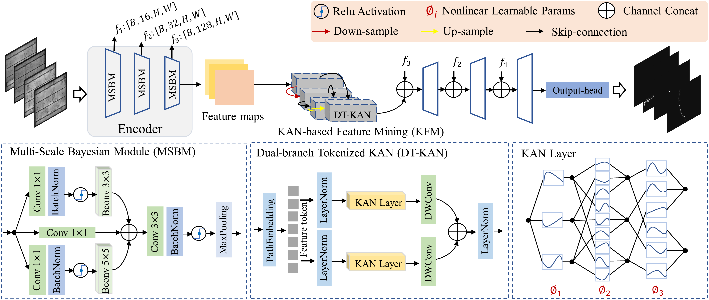
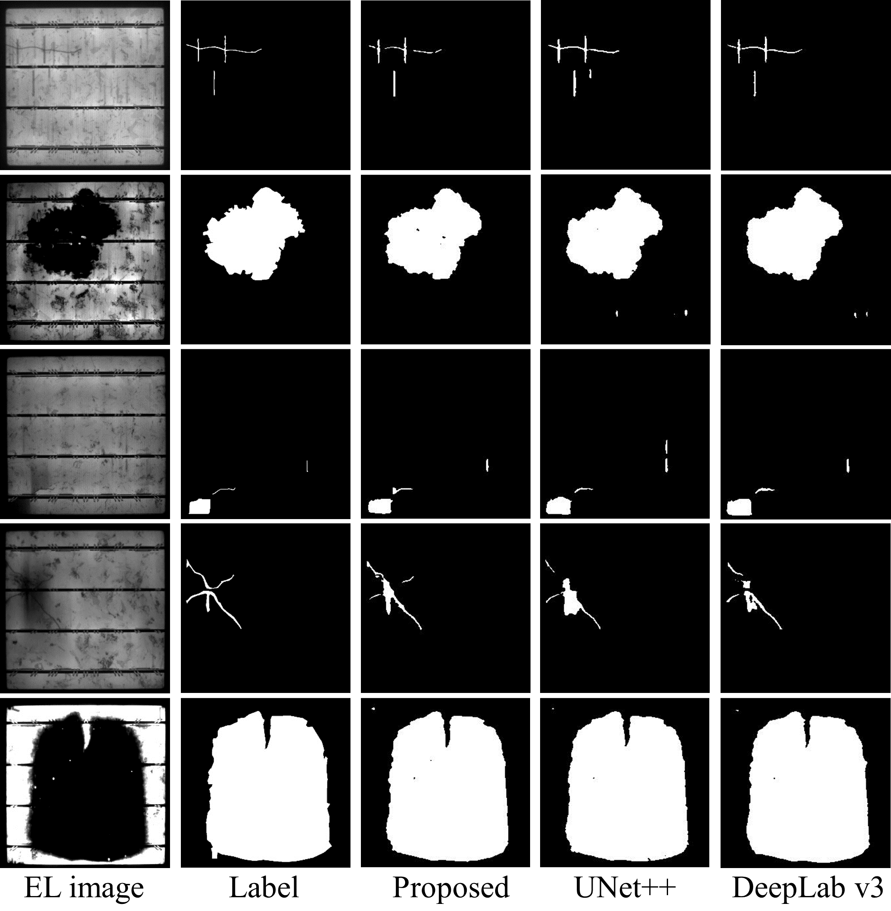

# **A Bayesian Convolution and Kolmogorov-Arnold Network based cell-level anomaly detection in photovoltaic solar panels**

## Network Architecture



## Environment Setup

To reproduce the environment, make sure you have [conda](https://docs.conda.io/en/latest/) installed.

```bash
# 1. Clone this repository
git clone https://github.com/yourname/your-repo.git
cd your-repo

# 2. Create the conda environment from the provided environment.yml
conda env create -f environment.yml

# 3. Activate the environment
conda activate ukan

# 4. (Optional) Update the environment if environment.yml changes
conda env update -f environment.yml --prune

### Datasets
 Put the [PVEL](https://www.kaggle.com/datasets/yaozhang01182010/dataset-of-solar-cells-defect-segmentation/data)

## Results and Saliency maps
We perform quantitative comparisons and qualitative comparisons with 6 co-SOD
methods on 3 datasets.



## Relevant Literature

```text
@article{li2024ukan,
  title={U-KAN Makes Strong Backbone for Medical Image Segmentation and Generation},
  author={Li, Chenxin and Liu, Xinyu and Li, Wuyang and Wang, Cheng and Liu, Hengyu and Yuan, Yixuan},
  journal={arXiv preprint arXiv:2406.02918},
  year={2024}
}

@article{shridhar2019comprehensive,
  title={A comprehensive guide to bayesian convolutional neural network with variational inference},
  author={Shridhar, Kumar and Laumann, Felix and Liwicki, Marcus},
  journal={arXiv preprint arXiv:1901.02731},
  year={2019}
}

@article{shridhar2018uncertainty,
  title={Uncertainty estimations by softplus normalization in bayesian convolutional neural networks with variational inference},
  author={Shridhar, Kumar and Laumann, Felix and Liwicki, Marcus},
  journal={arXiv preprint arXiv:1806.05978},
  year={2018}
}

...
```
